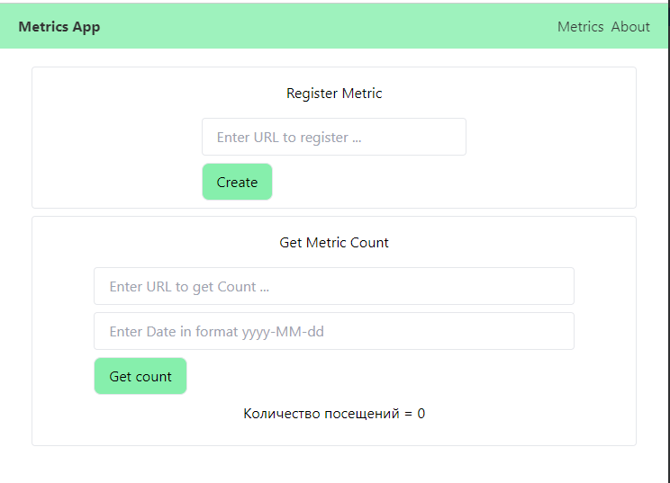

# Metrics API

API for collecting site visit metrics


## Screenshots

<p align="center">
    
    
</p>


## Authors

- [@pcatrina](https://www.github.com/octokatherine)


## Deployment

Для запуска необходимо иметь docker.

```bash
  docker compose up
```


## Documentation

[Swagger BACKEND](http://localhost:8080/api/swagger-ui/index.html)

